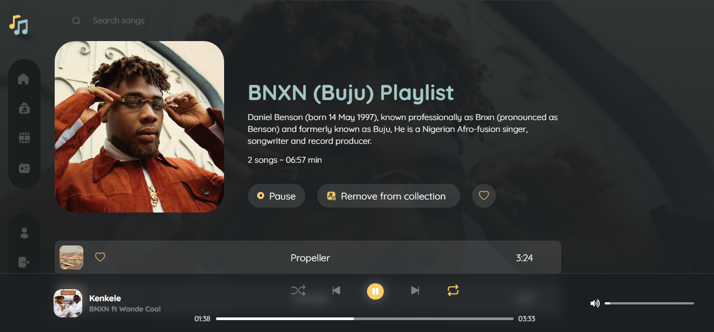

# musica
A responsive and functional music web app that can play, pause, repeat, skip, shuffle and search songs from an API.


### Screenshot

<details>
<summary>Screenshot</summary>



</details>


### Built with

- React
- TypeScript
- Semantic HTML5 markup
- Mobile-first workflow
- Tailwindcss
- Context API for state management
- [Music API](https://musica-api.onrender.com) from [@SanusiMuhyideen](https://twitter.com/SanusiMuhyideen)


## Project Setup

```sh
npm install
```

### Compile and Hot-Reload for Development

```sh
npm run dev
```

### Compile and Minify for Production

```sh
npm run build
```
